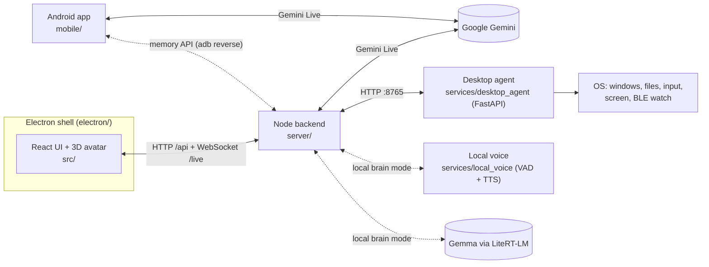

<p align="center">
  
</p>

<p align="center">
  <b>A private, emotionally aware 3D AI companion for your desktop and phone.</b><br/>
  Real-time voice, a living 3D avatar, on-device emotion sensing, long-term memory and hands-on desktop control.
</p>

<p align="center">
  <a href="https://github.com/samarthrao34/SIYA/actions/workflows/ci.yml"></a>
  
  
  
  
  
</p>

---

## What is SIYA?

SIYA is a desktop companion you talk to like a person. She listens and answers
in real time, reacts with a fully animated 3D body and face, notices how you
are doing through your camera and your words, remembers what matters to you,
and can act on your computer when you ask: open apps, manage files, read your
screen, search the web.

Privacy comes first. Each user brings their own Gemini API key. Emotion
sensing runs on-device. Personal data is encrypted at rest with a key held in
the OS keyring. For a fully offline setup, a local brain (Gemma + local
speech) can replace Gemini entirely.

## Features

| Area | What it does |
| --- | --- |
| **Live conversation** | Full-duplex voice and text over Gemini Live, with interruption, reconnect with backoff, wake word, and time-of-day greetings. |
| **3D avatar** | VRM/PMX character rendered with Three.js: lip-sync from the audio stream, gaze, idle behaviour, procedural gestures, expressions and physics. |
| **Emotion & behaviour sensing** | MediaPipe face and hand landmarks, run locally in WASM, read facial emotion plus longer-term cues such as yawning, fatigue, head-in-hands and fidgeting. Optional text-emotion reading of the user's words. |
| **Memory** | Long-term memories consolidated from conversations, browsable and editable in the Memories panel. |
| **Cognition** | An autonomous layer for attention, goals, planning, curiosity, social initiative, proactive check-ins, and a critic that reviews tool use. |
| **Desktop control** | 60+ tools through a local Python agent: apps and windows, files, mouse and keyboard, clipboard, screenshots and OCR, volume and brightness, web search, and power actions with two-step confirmation. |
| **Screen vision** | "Look at my screen" captures the display and feeds it to the model so it can answer about what you're seeing. |
| **Wellbeing** | Smartwatch heart-rate / SpO₂ sync over BLE with a health dashboard, plus a deterministic crisis-language safety net (English, Hinglish, Devanagari) that surfaces helplines. |
| **API hub** | Imports the public-APIs catalogue, health-checks providers, and runs verified adapters as tools. |
| **Offline brain** | Optional local mode: Gemma 4 via LiteRT-LM, Silero VAD and Kokoro / Edge TTS. Same tools, memory and avatar. |
| **Mobile** | A standalone Android app with the same avatar and persona that talks to Gemini directly from the phone. |
| **Desktop shell** | Electron app with splash, tray, window-state persistence, auto-updates, and AppImage / NSIS / DMG packaging. |

## Architecture



The Electron main process starts the bundled backend (`dist/server.cjs`) and
loads the UI it serves on `localhost:3000`. The backend owns the Gemini Live
session, memory, cognition, safety and screen vision, and it auto-spawns the
Python desktop agent. See [docs/ARCHITECTURE.md](docs/ARCHITECTURE.md) for a
deeper walkthrough.

## Repository layout

```
SIYA/
├── src/                    Desktop UI (React 19 + Vite + Tailwind 4)
│   ├── api/                Live session client (audio in/out, reconnect, tool events)
│   ├── character/          Three.js character engine, VRM/PMX loaders, stage
│   ├── components/         Main experience and panels (Settings, Memories, Health, Privacy…)
│   ├── settings/           Settings store and wake-word listener
│   └── vision/             On-device emotion and behaviour analysis (MediaPipe)
├── server/                 Node backend (Express + ws), bundled to dist/server.cjs
│   ├── index.ts            Entry point: HTTP API, /live relay, Gemini Live, tool routing
│   ├── cognition/          Autonomous mind: attention, goals, planner, critic, initiative…
│   ├── api-hub/            Public-API catalogue, adapters and health checks
│   ├── localLive.ts        Offline brain (Gemma + local voice) with the Gemini Live surface
│   ├── memory.ts           Long-term memory storage and consolidation
│   ├── safety.ts           Crisis-language detection and helplines
│   ├── screenVision.ts     Screen capture → model pipeline
│   ├── health.ts           Wearable health readings store
│   ├── secureStore.ts      AES-256-GCM encryption at rest
│   └── …                   paths, liveAudio, textEmotion
├── shared/                 Code shared by UI, mobile and server
│   ├── runtime/            Avatar event bus and speech timeline (lip-sync)
│   └── memoryTypes.ts
├── electron/               Desktop shell: main process, preload, splash, tray, updates
├── services/               Python sidecars
│   ├── desktop_agent/      FastAPI desktop-control agent (Linux / Hyprland)
│   └── local_voice/        Silero VAD + Kokoro / Edge TTS for the offline brain
├── mobile/
│   ├── app/                Standalone mobile web app (React), packed into the APK
│   ├── android/            Minimal Android WebView shell + local asset server
│   ├── build-mobile.sh     Builds and signs the APK (no Gradle)
│   └── connect-phone.sh    adb reverse so the phone reaches the desktop backend
├── public/                 Static assets: avatar models, MediaPipe WASM + models, brand
├── tests/                  Node test runner suites (desktop shell, live session, speech…)
├── docs/                   Architecture and reliability notes
├── build/                  App icon used by electron-builder
└── .github/workflows/      CI: typecheck, tests, build
```

## Getting started

### Prerequisites

- **Node.js 20+** (22 recommended) and npm
- **Python 3.10+** for the desktop agent (and the optional local voice service)
- A **Gemini API key** from [Google AI Studio](https://aistudio.google.com/apikey)
- Linux desktop control targets **Hyprland** (`hyprctl`). Other tools need
  `tesseract` for OCR and BlueZ for the smartwatch.

### Install

```bash
git clone https://github.com/samarthrao34/SIYA.git
cd SIYA
npm install

# Desktop agent dependencies
pip install -r services/desktop_agent/requirements.txt
```

### Configure

```bash
cp .env.example .env      # then set GEMINI_API_KEY (or enter it later in Settings)
```

All variables are documented in [`.env.example`](.env.example).

### Run

| Command | What it does |
| --- | --- |
| `npm run dev` | Backend + UI with hot reload on <http://localhost:3000>. The desktop agent is auto-spawned. |
| `npm run build && npm start` | Builds the UI and backend bundle, then launches the Electron app. |
| `npm run package` | Builds an installable package into `release/` (AppImage / NSIS / DMG). |

### Offline brain (optional)

```bash
python3 -m venv services/local_voice/.venv
services/local_voice/.venv/bin/pip install -r services/local_voice/requirements.txt
# put silero_vad.onnx, kokoro-v1.0.onnx and voices-v1.0.bin in services/local_voice/models/
SIYA_BRAIN=local npm run dev
```

The backend starts the voice service on demand and expects an
OpenAI-compatible Gemma endpoint at `SIYA_LOCAL_LLM_URL`.

### Mobile (Android)

```bash
cp mobile/app/.env.example mobile/app/.env   # set VITE_SIYA_BRAIN_TOKEN
./mobile/build-mobile.sh                     # → mobile/build/siya-mobile.apk
./mobile/connect-phone.sh                    # optional: link phone to desktop memory over USB
```

The build script needs the Android SDK build tools (36.x) and JDK 17. It
assembles the APK with `aapt2`/`d8`/`apksigner` directly, without Gradle.

## Development

```bash
npm run typecheck   # server, desktop UI and mobile app
npm test            # node:test suites in tests/
npm run build       # production UI + server bundle
```

CI runs the same three steps on every push and pull request, plus a Python
byte-compile of `services/`.

Conventions:

- Backend code lives in `server/` and is type-checked strictly
  (`tsconfig.json`). UI and mobile have their own configs.
- Anything used by more than one of UI, mobile and server goes in `shared/`.
- The tool list in `services/desktop_agent/registry.py` must match
  `DESKTOP_TOOLS` in `server/index.ts`. The agent logs a warning on mismatch.
- Never commit `.env`, keystores, `.siya-data/` or `logs/`; they hold keys and
  personal conversations. `.gitignore` covers them.

## Privacy & safety

- **Your key, your data.** No SIYA-operated backend. Requests go from your
  machine to Gemini with your own key. The two optional services that send
  text elsewhere (TypeSafe text-emotion, Edge TTS in local mode) are marked
  in `.env.example` and can be turned off.
- **Encrypted at rest.** Memories, goals, health readings and session state
  are encrypted with AES-256-GCM. The key is sealed in the OS keyring via
  Electron `safeStorage`.
- **On-device perception.** Camera frames are analysed locally. Only derived
  emotion and behaviour states reach the model.
- **Consent and control.** A first-run consent and age gate, a Privacy Center
  that explains what is stored and offers "delete all my data", and two-step
  confirmation for destructive desktop actions.
- **Crisis safety net.** Deterministic detection on every message, independent
  of the model, shows helpline numbers on screen.

SIYA is a companion, not a medical device or a replacement for professional
care.

## Further reading

- [docs/ARCHITECTURE.md](docs/ARCHITECTURE.md): how the pieces fit together
- [docs/RELIABILITY.md](docs/RELIABILITY.md): reconnects, tray behaviour, updates and packaging

## Author

Built by **Samarth Rao** ([@samarthrao34](https://github.com/samarthrao34)).
